# P7 result: professional polish of the Machinedrum and Monomachine Editors

- **Branch:** `p7/polish` (from `p6/simple-core` @ 0993cd9b), 2026-09-28. Pushed after each item. No PR and no release.
- **Architecture:** P6's is kept.
  - The mockups are the design source, synced into the skins.
  - New behaviour is data: the modal kinds, the model's `hostFollowing` and the `followHost` command row.
  - The pure parts (`windowFit`, `hostFollowing`, `lenStep`) have their own tests.
- **The critique:** [DESIGN-REVIEW-P7.md](DESIGN-REVIEW-P7.md).
- **The sync design:** [DESIGN-P7-sync.md](DESIGN-P7-sync.md).
- **Screenshots** are from the browser harness: the shipped skin files on a fake host, P6 (0993cd9b) on the left, P7 on the right, in `p7-shots/`.

## Radek's list

| # | Item | Result | Evidence |
|---|---|---|---|
| 1 | All steps by default, paging optional | **Done**, MD and MM. PAGE, the page LEDs and FOL still page. | 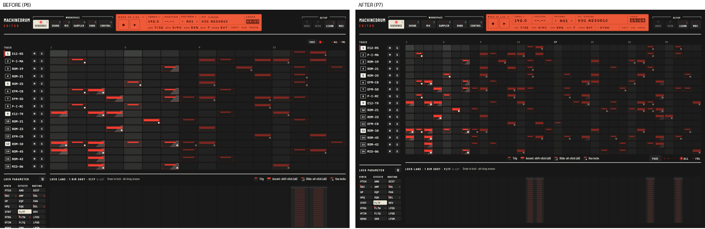 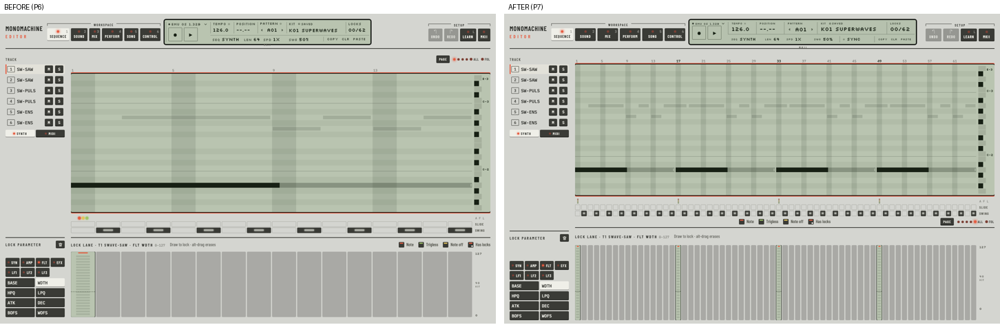 |
| 2 | MM: LEN could not be changed | **Fixed.** A click stepped a page but stopped at 64, which is every factory pattern. It now goes round (16, 32, 48, 64, 16), shift-click goes back and a scroll steps one. | `mmConvertTest` (lenStep). The MM p7 self-test: "LEN 64 -> 16 -> 64, read back each". Firmware: LEN 32 and 17 on the playing pattern are stored and played (`mmDeskFirmwareTest patterns`). |
| 3 | Modals: centred, backdrop, focus trap, Esc, click-outside rules, one system | **Done.** One MODAL layer, the same text in both apps, checked by `modal_check.py`. A question starts on Cancel, stays on a click outside, and Esc answers Cancel. Panels close on Esc and on a click outside. | 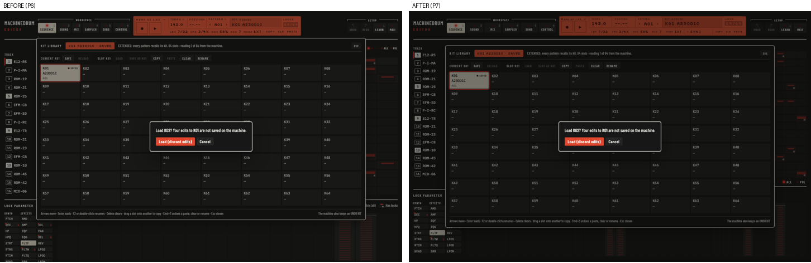 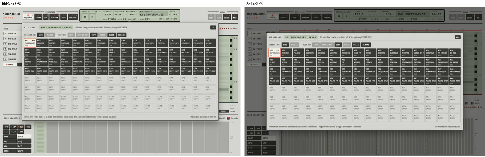 Self-tests: MD p7 and MM p7, "modal" checks. |
| 4 | LCD: fixed sync slot, pixel grid, rule weights, no stray line, even lines, both plates and both machines | **Done.** One LCD block in both apps. The sync slot on line 2 shows SYNC, SEND or RECV n. | 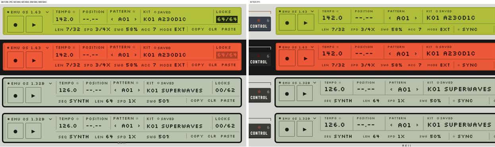 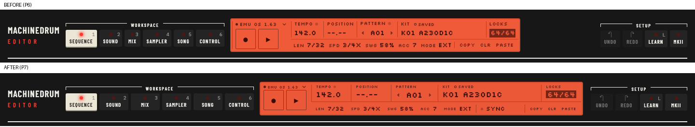 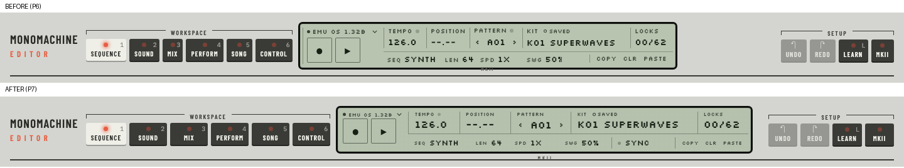 |
| 5 | Layout: the full window, fluid rows, the lock lane never overflows, Sound and engine pages use the space, the window within the visible frame and remembers its size, MM Mix strips and the MKII print aligned | **Done.** The window is fitted by `windowFit` (pure, `mdWindowFitTest`). The page editors resize freely and keep their width and height. The MM Mix strip puts the fader and its LEV value in one column, as tall as the value boxes. | 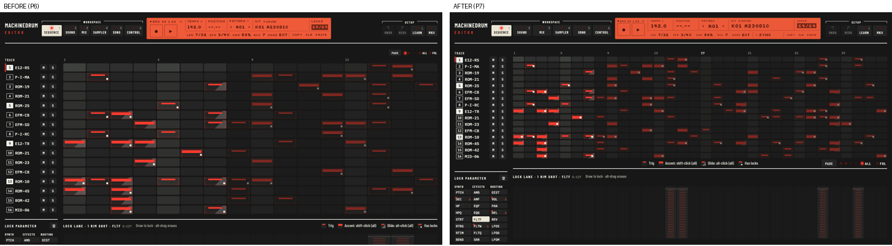 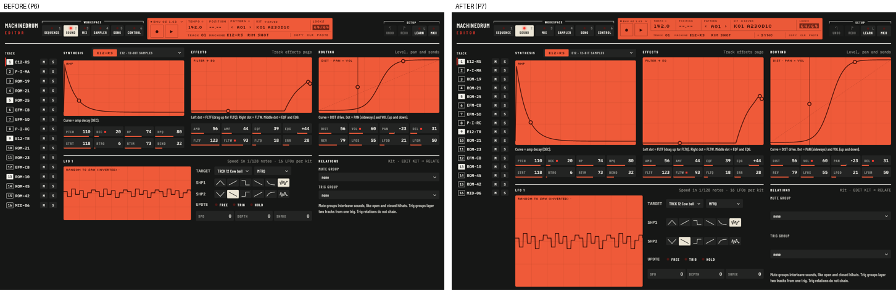 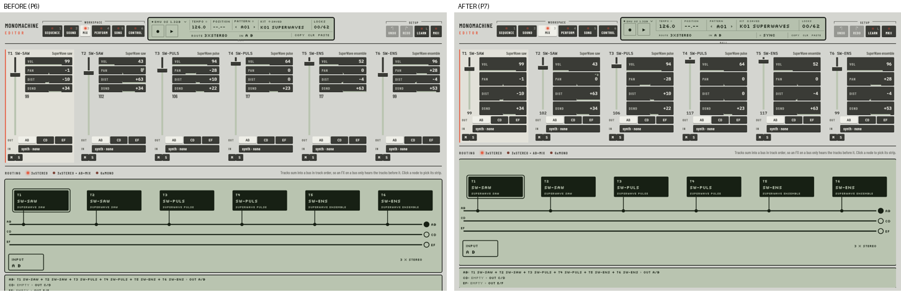 In the app, the window came up at 2028 × 1301 and was fitted to 1800 × 1024 at 0,71, above the Dock. Self-tests: "the page fits the window: page 1024 / window 1024, lock lane bottom 1014" (both apps). |
| 6 | MM: a loaded pattern always flagged as edited, and the popup every time | **Root cause fixed** (see below). | MM p7 self-test: loads stopped and playing, all kits clean and nothing asked; the stuck-drag case. Firmware: six loads clean (`mmDeskFirmwareTest patterns`). |
| 7 | Workspace keys: MIX too small, even row | **Done.** Minimum 60 px for workspace keys, 46 px for setup keys. |  |
| 8 | Drag-paint with one undo step, Shift-armed mutes, lock drawing, paging bottom right, legend in the middle | **Done.** MD: painted trigs. MM: SLIDE, SWING and the envelope steps (its notes are the roll's own drag). Mutes: the MM now prepares them with Shift, as the MD already did. | Self-tests: MD p7 "4 steps on, undo 0 -> 1; off"; MM p7 "undo 0 -> 1 -> 2"; MM "prepared 0X 1X, nothing sent while held"; MD p4 "Shift-prepared". Lock drawing: MD self-tests 1, p5. |
| Sync | DAW follows the host; standalone Link, IAC or shared memory | **In a DAW: done.** Both machines follow the host's clock and transport. The LCD's sync slot shows HOST. **Standalone:** Radek chose Ableton Link, for v0.3; nothing was downloaded. MIDI clock over IAC is the alternative until then. See [DESIGN-P7-sync.md](DESIGN-P7-sync.md), which also covers how long the follow setting lasts. | `mdDeskFirmwareTest hostclock` and `mmDeskFirmwareTest hostclock`: not following as booted; after `followHost` they follow 100 and 150 BPM (ratio 1.52 and 1.58) and Stop, with no undo step. |

## Added during P7 (Radek's requests)

| Item | Result | Evidence |
|---|---|---|
| Start-up card | **Done**, both apps. While the firmware starts, one modal card covers the whole window: the header is dimmed too, and nothing behind the card takes a key or a click. The card shows the machine's own LCD mirrored big (pixel for pixel, in the plate's LCD colours), a progress bar and "Keys work when the start-up animation ends." It fades out when the machine takes input, and does not wait for the library read. The header's LCD keeps its normal state. | 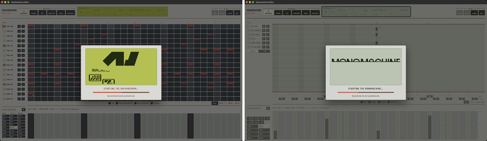 (the real apps, booting) Self-tests: MD p7 and MM p7, "the start-up card covers the window and blocks input", "mirrors the firmware's LCD" (558 and 1943 pixels), "gone once the machine takes input". |
| ROM install | **Done**, both apps. NO ROM and ROM ERROR are the same card, with the steps, **Choose ROM file…** (a native chooser), a drop target for the whole window, and "Show the ROM folder" as a link. The host validates the file (`md::checkRom`): it must be 8 MiB, and it must be the right model and version, by the known fingerprints. It copies the file into the ROM folder, never overwriting another file, and restarts the machine at once (`rebootDevice`). Nothing leaves the computer, and the card says so. Drops pass through the web view to the editor (`passFileDropsToEditor`). | 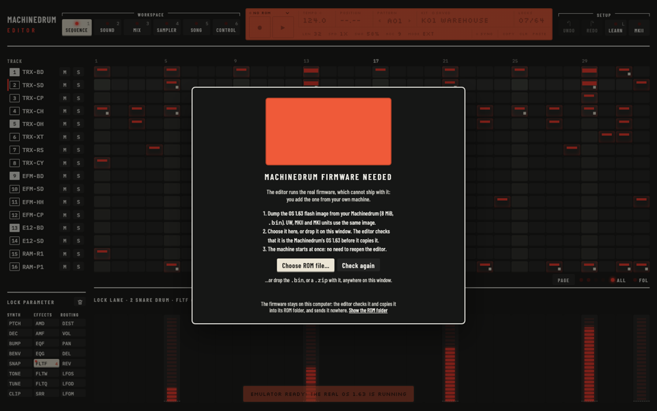 `mdRomInstallTest`: wrong size, not a .bin, a .zip without a .bin, an unknown image, the other machine's firmware, a .zip holding the image, no overwrite, no double copy. |
| SysEx import and export | **Done**, both apps. **Import SysEx…** (in both libraries) or a .syx dropped on the window: the host parses it (`elektronData::syxImport`) and the page shows a preview panel. The panel lists what the file holds, what it overwrites, and what this OS cannot take as it is. The chosen kinds (globals are off by default) go out as ordinary document writes, as one undo step, a few per step, with progress and Stop. **Export SysEx…** writes every document the editor holds to a .syx. | 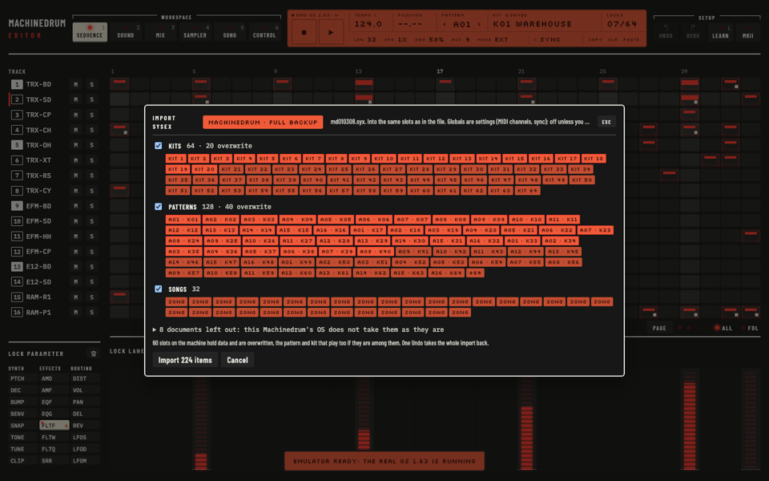 `syxImportTest` (49 checks). `syxImportFileTest`: both AE backups, every message byte-exact. MD firmware: 222 of 224 imported documents read back equal (see below). MM firmware: 121 of 121 of those it takes. The session test publishes and validates syxPreview, syxProgress and syxExport. |
| Read progress | **Done**, both apps. The engine label shows only the engine. The background read shows in the LCD's sync slot as "170/288", with a thin bar under it. By priority, the slot shows the read, then SEND, then HOST, then SYNC. The slot has a fixed width and sits on line 2's baseline. The LCD's tooltips now show under the display, never over it. | 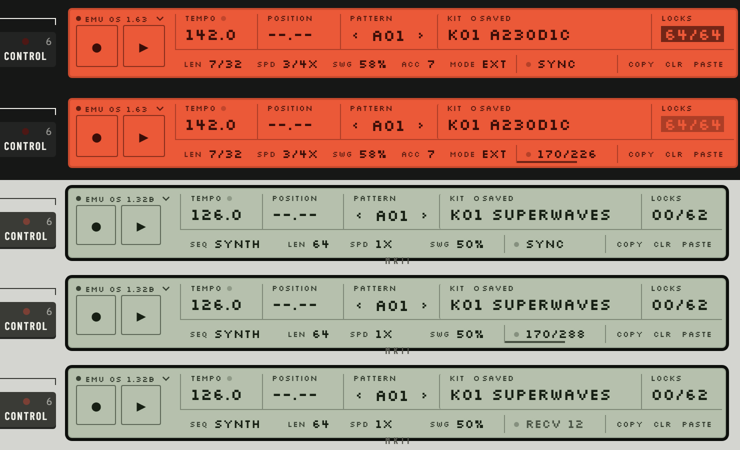 (MD sync and read; MM sync, read and RECV, on both plates) |

**Import limits (measured, shown in the preview's "left out" list):**
- **MD:** the AE backup's globals are format 5/1 (an older OS), which OS 1.63 converts. Two of its kits hold name bytes that the contract's name does not carry; they read back with a different name.
- **MM:** the AE backup was made by an older OS. OS 1.32B ignores its 128 kit dumps, which are shorter, so the preview leaves them out. 31 of its patterns do not validate (a note without a trig). The other patterns and all the songs import byte-exactly.

### The root cause of item 6

The core was right. The firmware rig loads six patterns, and every kit is clean with no question.

The page was the problem:
- **A drag outlived its element.** A render during a drag (a pattern load, or the machine's documents arriving) removed the element that held the pointer.
- **Its end was lost.** The pointerup then landed outside `#main`, and only `#main` listened for it, so the drag stayed on.
- **Every mouse move then edited.** The move over the page edited the dragged value: in the report, a Mix level (T6 LEV 24 against the stored 86). That marked the kit edited, so the next load asked.
- **The page also stopped showing the machine**, because it was still "busy" in the gesture.

The fix, in both apps: a gesture ends on the document's pointerup, on any move with no button down, and on leaving the window.

The test reproduces the fault on P6: the harness sent `set:workingKit` on a plain mouse move and stayed busy. On P7 the result is 0 edits and not busy.

A second MD bug came to light on the way. The pointer-capture helper was shadowed by the sampler model's `capture(n, bins)`, so no drag had held the pointer since P3 (it is now `grabPointer`).

## Beyond the list (from the review)

- **A layout selector clash.** `.body` reached the MM routing diagram's `rect.body`, which stretched its nodes. It is now scoped as `.app>.body`.
- **MM global pushes to the active slot** are now made active (0x56) once the panel has left SYSEX RECV. The firmware applies a global only then; the MD already did this.
- **The MM global's raw 0x05 and 0x06** are documented: MIDI SYNC CLOCK IN and TRANSPORT IN.
- **Workspace keys, the lane legend and paging** are consistent between the two apps.
- **Open**, as listed in the review:
  - the stylesheet sediment (merge the older override layers);
  - the MM routing viewBox;
  - the Control and Song page space;
  - an LCD zoom floor.

## Tests

| What | Result |
|---|---|
| Unit tests (`ctest -E "Plugin\|_AU\|VST\|FirmwareTest"`) | **76 of 78** (new: `mdWindowFitTest`, `mdRomInstallTest`, `syxImportTest`, `syxImportFileTest`). The 2 failures are the known `synthLibMidiClockTimingTest` and `synthLibAudioTest`. |
| Page tests | `mdDeskModelTest.js` and `mmConvertTest.js` (new: lenStep) pass. Both sync scripts pass `--check`, including the page contract, the AUDIO / MIDI panel and the MODAL checks. |
| Firmware tests | See the final run below. |
| In-plugin self-tests | See the final run below. New: MD `p7` (11 checks) and MM `p7` (11 checks). |
| Release build (diagnostics OFF, `temp/cmake_p7rel`) | **Compiles**, at every commit checked (a96eaf5e and the final one). |
| auval, from a temporary user install that was removed again | **AU VALIDATION SUCCEEDED** for `aumu Tmdr GmPv` and `aumu Tmno GmPv` (release build). |

### The final run (the last commit)

- **Build:** 0 errors (diagnostics ON). The release build, with diagnostics OFF, has 0 errors.
- **Unit tests:** 76 of 78. The 2 known `synthLib` failures remain.
- **Firmware tests:**
  - `mdDeskFirmwareTest`: default, `hw`, `p4`, `hostclock` and `syximport` PASS; `playload` 3/3.
  - `mmDeskFirmwareTest`: default (smoke, trig kinds, patterns, hostclock) PASS; `syximport` 121/121 PASS.
  - `mdSessionFirmwareTest`, `mmBootFirmwareTest` and `mdRomInstallTest` (with the real images): PASS.
- **Self-tests:**
  - MD: `1` done, `p4` done, `p4hw` done, `p5` done, `p6audio` 7/7, `p7` 11/11.
  - MM: `1` 11/11, `p6audio` 7/7, `p7` 9/9 (the MM p7 also counts the start-up card's three checks).
- **auval** (release build, temporary user install, removed): AU VALIDATION SUCCEEDED for both.
- **Radek's four files**, restored after each run: `3964db19af55 fc68a82e43b5 09197ffa012e 8a06fa3f4baf`. The hashes before and after were equal every time.

## Radek's config and settings

- **Every run was bracketed.** Each standalone run and the auval run happened under the shared `standalone.lock`. Each one took a snapshot of the four files first and restored them byte for byte after, printing both hash sets; all were equal ("RESTORED byte for byte").
- **Another agent changed the files between my runs.** For example, `Gearmulator MD.xml` had `pluginPath_vst3` pointing at the p6 build. I restored the state I found each time, not the older P6 backups.
- **The last hashes** were:
  - MD xml: `3964db19af55`
  - MD settings: `fc68a82e43b5`
  - MM xml: `09197ffa012e`
  - MM settings: `8a06fa3f4baf`
- **The installed alpha** v0.1.0 in `/Library` was not touched: nothing was installed, and the temporary AU components in `~/Library/Audio/Plug-Ins/Components` were removed.

## What Radek must do

- **Standalone sync:** Link is in v0.3, as decided. Until then, MIDI clock over IAC works through the machines' global sync settings, but it is not wired into the UI.
- **Try the DAW sync once in Live or Logic:** play, change the tempo, loop, and stop. This has not been automated.
- **Merge or cut:** `p7/polish` is release-ready at every pushed commit.
